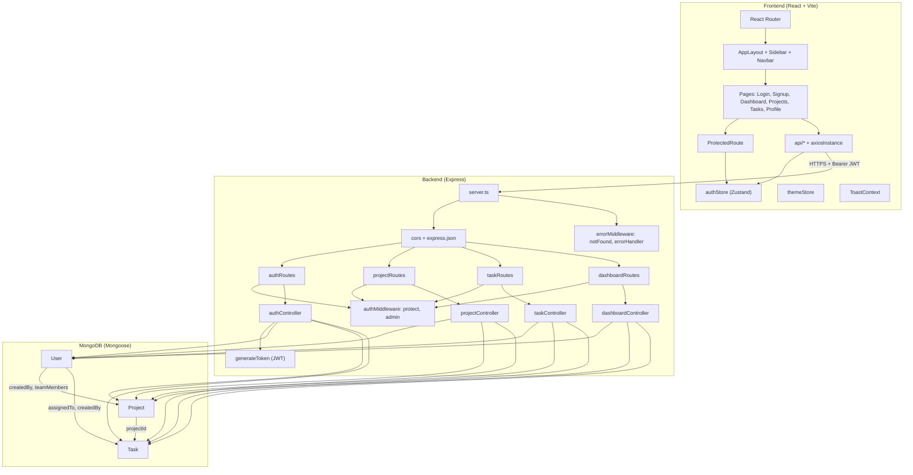
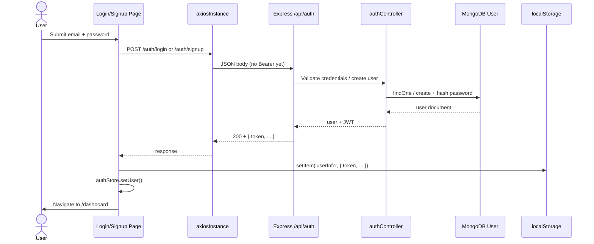
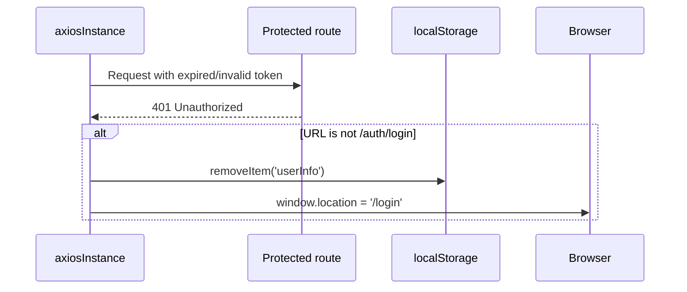
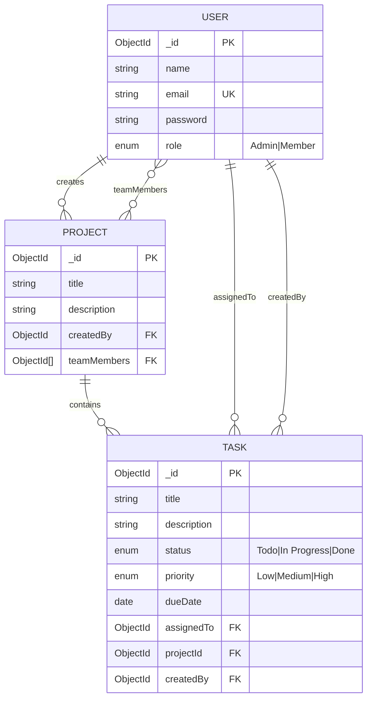

# TaskManager

A full-stack task and project management application with role-based access (Admin / Member), JWT authentication, and a React dashboard for tracking projects, tasks, and stats.

## Live demo

| Page | URL |
|------|-----|
| **Dashboard** | [https://algotaskflow.vercel.app/dashboard](https://algotaskflow.vercel.app/dashboard) |
| **Login** | [https://algotaskflow.vercel.app/login](https://algotaskflow.vercel.app/login) |
| **Signup** | [https://algotaskflow.vercel.app/signup](https://algotaskflow.vercel.app/signup) |
| **Projects** | [https://algotaskflow.vercel.app/projects](https://algotaskflow.vercel.app/projects) |
| **Tasks** | [https://algotaskflow.vercel.app/tasks](https://algotaskflow.vercel.app/tasks) |

Frontend is hosted on [Vercel](https://vercel.com). Set backend `CLIENT_URL` to `https://task-m-frontend-9xjj.vercel.app` so CORS allows this origin.

---

## Screenshots

Add your UI captures under `docs/images/` and they will render below.

### Dashboard


> **Placeholder:** `docs/images/dashboard.png` — task stats, status breakdown, overdue count.

### Projects


> **Placeholder:** `docs/images/projects.png` — project list, team members, create/edit modal.

### Tasks


> **Placeholder:** `docs/images/tasks.png` — kanban-style or list view with status and priority.

### Login


> **Placeholder:** `docs/images/login.png` — authentication screen.

### Architecture (optional)


> **Placeholder:** `docs/images/architecture.png` — high-level deployment (Vercel + Render + Atlas).

---

## Features

- **Authentication** — Sign up, login, JWT sessions, profile (`/api/auth`)
- **Projects** — CRUD with team members (Admin creates/updates/deletes)
- **Tasks** — Todo / In Progress / Done, priorities, due dates, assignees
- **Dashboard** — Aggregated task metrics and charts
- **Roles** — `Admin` (full project/task management) vs `Member` (view + update assigned tasks)
- **Theming** — Light/dark mode (Zustand + Tailwind)
- **Resilience** — Global 401 handling redirects to login

---

## Tech Stack

| Layer      | Technologies                                      |
|-----------|---------------------------------------------------|
| Frontend  | React 19, Vite, TypeScript, Tailwind CSS, Zustand, Axios, Recharts |
| Backend   | Node.js 20, Express 5, TypeScript, Mongoose       |
| Database  | MongoDB (Atlas recommended)                       |
| Auth      | JWT (`jsonwebtoken`), bcrypt password hashing     |
| Deploy    | Vercel (frontend), Render (backend) — see sub-READMEs |

---

## Repository Layout

```text
TaskManager/
├── frontend/          # React + Vite SPA
│   ├── src/
│   │   ├── api/       # Axios client + REST helpers
│   │   ├── pages/     # Login, Dashboard, Projects, Tasks, Profile
│   │   ├── store/     # authStore, themeStore
│   │   └── components/
│   └── README.md
├── backend/           # Express API
│   ├── src/
│   │   ├── controllers/
│   │   ├── models/    # User, Project, Task
│   │   ├── routes/
│   │   └── middleware/
│   └── README.md
└── docs/images/       # Screenshots for this README
```

---

## Quick Start

### Prerequisites

- Node.js 20+
- MongoDB instance (local or [MongoDB Atlas](https://www.mongodb.com/cloud/atlas))

### 1. Backend

```bash
cd backend
npm install
cp .env.example .env
# Set MONGO_URI and JWT_SECRET in .env
npm run dev
```

API base: `http://localhost:5001/api`

### 2. Frontend

```bash
cd frontend
npm install
cp .env.example .env
# VITE_API_URL=http://localhost:5001/api
npm run dev
```

Open the Vite dev URL (typically `http://localhost:5173`).

### Environment Variables

| App      | Variable        | Description |
|----------|-----------------|-------------|
| Backend  | `MONGO_URI`     | MongoDB connection string |
| Backend  | `JWT_SECRET`    | Secret for signing JWTs |
| Backend  | `PORT`          | Server port (default `5001`) |
| Backend  | `CLIENT_URL`    | Frontend origin for CORS (production) |
| Frontend | `VITE_API_URL`  | Backend base URL ending with `/api` |

Do not commit `.env` files.

---

## API Overview

| Prefix            | Purpose |
|-------------------|---------|
| `GET /api/health` | Health + DB status |
| `/api/auth`       | signup, login, profile, users (admin) |
| `/api/projects`   | Projects CRUD |
| `/api/tasks`      | Tasks CRUD |
| `/api/dashboard`  | Statistics |

Detailed deploy steps: [backend/README.md](./backend/README.md) and [frontend/README.md](./frontend/README.md).

---

## Low-Level Design (LLD)

Component-level view of the monorepo: browser SPA, Express layers, and MongoDB collections.



### Backend module responsibilities

| Module | Responsibility |
|--------|----------------|
| `models/User` | Credentials, bcrypt hash on save, `matchPassword` |
| `models/Project` | Title, description, creator, team member refs |
| `models/Task` | Status, priority, due date, assignee, project ref |
| `middleware/authMiddleware` | Verify JWT, attach `req.user`, `admin` gate |
| `middleware/errorMiddleware` | 404 + centralized error responses |
| `utils/generateToken` | Issue JWT after login/signup |

### Frontend module responsibilities

| Module | Responsibility |
|--------|----------------|
| `api/axiosInstance` | Base URL, attach token, 401 → clear storage + `/login` |
| `store/authStore` | Persist `userInfo` in `localStorage` |
| `components/ProtectedRoute` | Redirect unauthenticated users |
| `api/*.ts` | Typed calls to `/auth`, `/projects`, `/tasks`, `/dashboard` |

---

## Data Flow

### 1. Authentication flow (login / signup)



### 2. Authenticated API request (e.g. list tasks)

```mermaid
sequenceDiagram
  participant Page as Tasks Page
  participant AX as axiosInstance
  participant MW as protect middleware
  participant TC as taskController
  participant DB as MongoDB

  Page->>AX: GET /tasks
  Note over AX: Read userInfo from localStorage
  AX->>AX: Authorization: Bearer &lt;token&gt;
  AX->>MW: HTTP request
  MW->>MW: jwt.verify(JWT_SECRET)
  MW->>DB: User.findById
  MW->>TC: req.user set
  TC->>DB: Task.find + populate
  DB-->>TC: task documents
  TC-->>Page: JSON array
```

### 3. Session expiry (401)



### 4. Entity relationships (data model)



---

## Deployment (summary)

| Service   | Host    | URL / notes |
|-----------|---------|-------------|
| Frontend  | Vercel  | [https://task-m-frontend-9xjj.vercel.app](https://task-m-frontend-9xjj.vercel.app) — set `VITE_API_URL` to your Render API + `/api` |
| Backend   | Render  | `MONGO_URI`, `JWT_SECRET`, `CLIENT_URL=https://task-m-frontend-9xjj.vercel.app` |
| Database  | Atlas   | Allow `0.0.0.0/0` for Render egress |

See [backend/README.md](./backend/README.md) and [frontend/README.md](./frontend/README.md) for step-by-step instructions.

---

## License

ISC (backend package). Add a root license file if you open-source the full monorepo.
